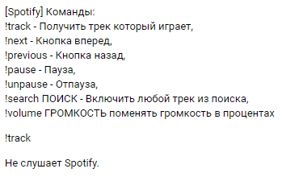

# VK Spotify Integration
## Python script that allows you to control your Spotify from your VK, set status for VK and more.
# Features:
- Shazam support for voice messages.
- Genius support with command "lyrics" (returns lyrics of the song)
- Spotify integration (Song searching, changing song, getting song values)
# Requirements:
### Minimal install (No loguru, no shazam / genius)
- pip install -r requirements-min.txt 
### Maximal install (All need modules)
- pip install -r requirements-max.txt

# Preview in VK:

